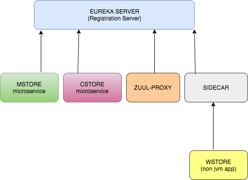

# spring-cloud-sidecar-sample
This project contains samples demonstrating the usage of side car polygot.
Spring cloud side car helps to register non jvm applications in eureka service registration/discovery.



<table>


 <tr>
    <th style="text-align:left">Name</th>
    <th style="text-align:left">Port</th> 
    <th style="text-align:left">Description</th>
  </tr>
  <tr>
    <td><a href="https://github.com/BarathArivazhagan/spring-cloud-sidecar-sample/tree/master/eureka-server"> eureka-server</a></td>
    <td>9000</td>
    <td>Eureka server - service registration server</td>
  </tr>
  <tr>
    <td><a href="https://github.com/BarathArivazhagan/spring-cloud-sidecar-sample/tree/master/csstore-microservice">csstore-microservice</a></td>
    <td>9001</td>
    <td>Service discovery microservice registered with eureka server</td>
  </tr>
  <tr>
    <td><a href="https://github.com/BarathArivazhagan/spring-cloud-sidecar-sample/tree/master/msstore-microservice">msstore-microservice</a></td>
    <td>9002</td>
    <td>Service discovery microservice registered with eureka server</td>
  </tr>
  <tr>
    <td><a href="https://github.com/BarathArivazhagan/spring-cloud-sidecar-sample/tree/master/sidecar">sidecar</a></td>
    <td>9004</td>
    <td>Side car proxy for routing and filtering to wstore node app</td>
  </tr>
   <tr>
    <td><a href="https://github.com/BarathArivazhagan/spring-cloud-sidecar-sample/tree/master/wstore-node-express">wstore-node-express</a></td>
    <td>3005</td>
    <td>Node express (non jvm ) application </td>
  </tr>
  <tr>
    <td><a href="https://github.com/BarathArivazhagan/spring-cloud-sidecar-sample/tree/master/zuul-proxy">zuul-proxy</a></td>
    <td>9005</td>
    <td>Zuul proxy for routing and filtering</td>
  </tr>
</table>


## How to build and run ?

 * Download/Clone the repository : 
   
   ```
   ./mvnw clean install

   ```

 * To run the application :

	  ```
	  docker-compose up

	  ```

## How to test the application ? 

Use zuul proxy to route to respective microservices. 

zuul route definition : 

```
zuul:
  routes:
    msstore :       
        path: /msstore/**
        url: http://localhost:9002
    csstore: 
        path: /csstore/**
        url: http://localhost:9001

```
<div>
	<span>Navigate to <a href="http://localhost:9005/msstore">http://localhost:9005/msstore</a>  for msstore </span><br>
    <span>Navigate to <a href="http://localhost:9005/csstore">http://localhost:9005/csstore</a> for csstore </span>
</div>

## Side car route definition 

```
zuul:
  routes:
    wstore: 
      path: /wstore/**
      url: http://localhost:3000

sidecar:
  port: 3000
  health-uri: http://localhost:3000/health

```

### Notes : 


<b>sidecar.port</b> : Port must be same as the non jvm port <br>
<b>sidecar.health-uri</b>: non jvm application should expose this url with json message {"STATUS" : "UP"} to indicate sidecar the app is UP.

## How to test sidecar ? 

<div>
   Navigate to <a href="http://localhost:9004/wstore/home">http://localhost:9004/wstore/home</a> --> sidecar routes to non jvm(nodejs app)  
</div>

## Why Zuul as well as side car ? 

yes, thats right. `@EnableSideCar` includes `@EnableZuulProxy`sidecar.png so side car can act as zuul proxy itself. 
In order to provide separate proxy for side car(non jvm) based applications, this repo contains two proxies

<i>zuul-proxy</i> : provides proxy to jvm based applications. <br>
<i>sidecar </i> : provides proxy to non jvm based applications.

#### Future Actions : 

* Config server : externalize the properties. 
* Introduce hysterix stream and feign clients to interact with other microservices.


## How to rebuild the project after the changes? 

```
  docker-compose build

```


## References 


* http://cloud.spring.io/spring-cloud-netflix/spring-cloud-netflix.html
* https://dzone.com/articles/spring-cloud-sidecar
* http://www.java-allandsundry.com/2015/09/spring-cloud-sidecar.html
* http://stytex.de/blog/2016/01/18/spring-cloud-sidecar-applications/


